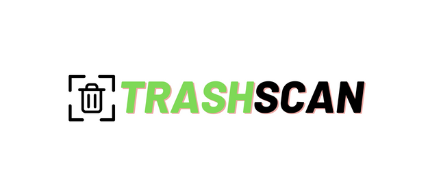
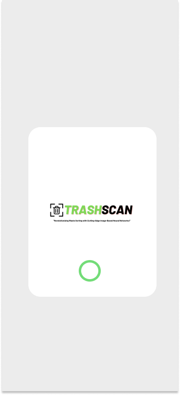
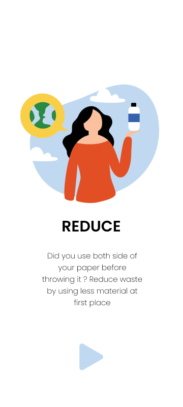
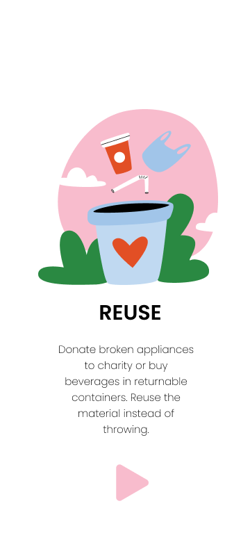
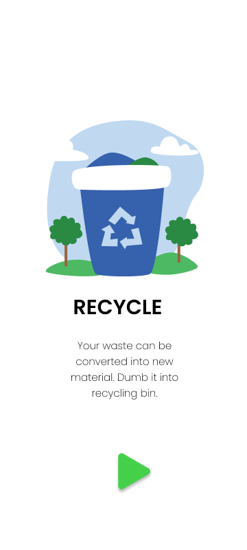
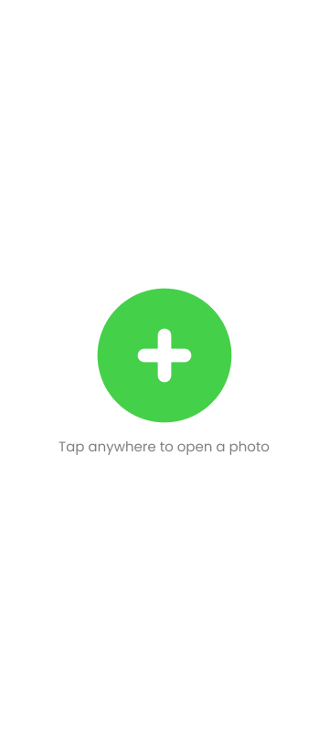
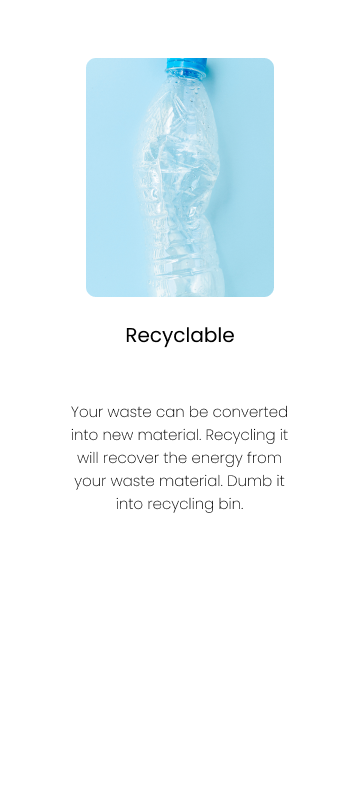

<h1 align="center"> Trash Scan </h1>
 

 Revolutionizing waste sorting with cutting-edge image based neural networks 

# Description
 
 
Trash Scan uses deep learning to allow user to classify their waste product. 

# Screenshots of our App

 

 

# Technologies,Libraries and Packages Used

 * Kotlin
 * Android Studio
 * Navigation Component
 * XML
 * Data Binding
 * TensorFlow Lite
